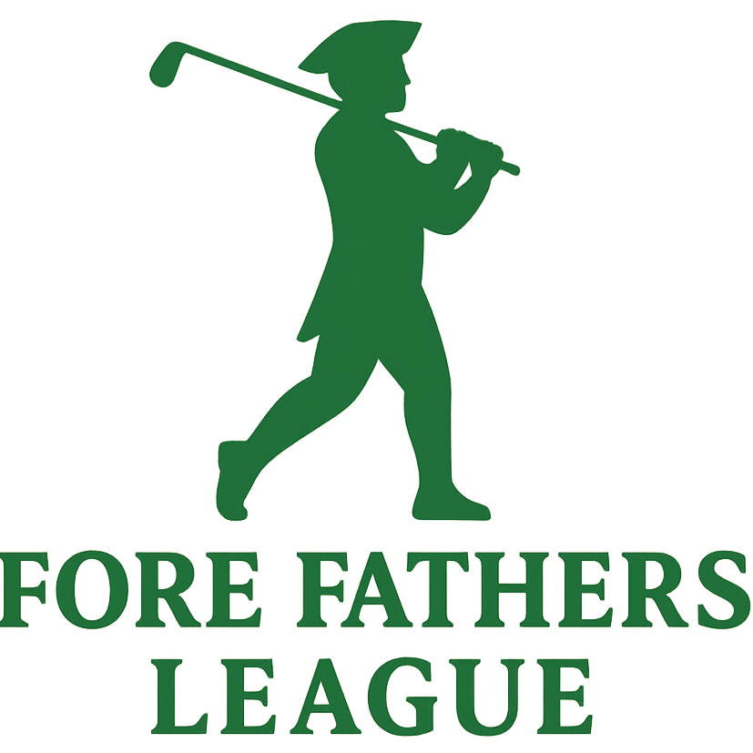

  

 ⛳ Fore Fathers Golf League Tracker

Fore Fathers is a full-stack web app that tracks matches, players, and performance statistics for a weekly golf league. Built for a group of golfing buddies, this app brings stats into one centralized platform.

---

## 🧠 Features

- Match history with win/loss and scoring breakdowns
- Player profiles with performance stats
- Dashboard with league standings
- Match detail pages with team breakdowns
- 🗄Fully connected backend with MongoDB

---

## ⚙️ Tech Stack

### Frontend
- React (with Vite)
- Tailwind CSS
- React Router
- Deployed to [Render Static Site](https://render.com)

### Backend
- Node.js + Express
- MongoDB (via Mongoose)
- REST API for players, matches, and dashboard data
- Deployed to [Render Web Service](https://render.com)

---

## 📁 Project Structure

- client/ React + Vite frontend
- server/ Express + MongoDB backend
- README.md
